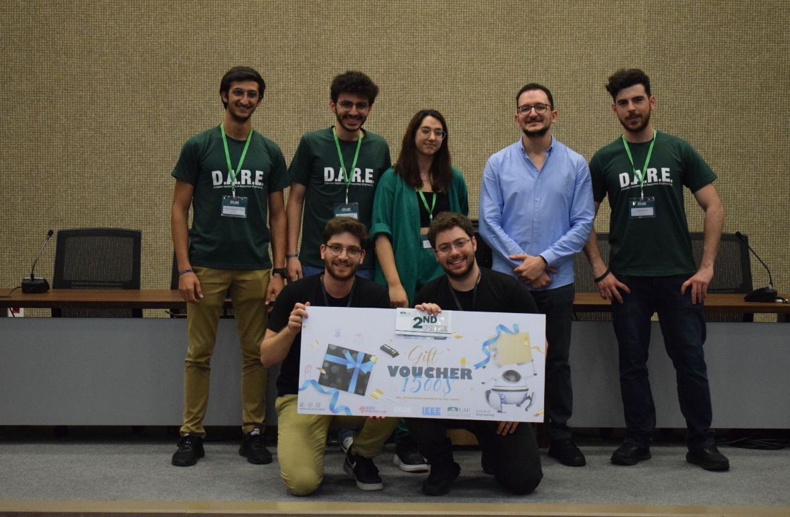
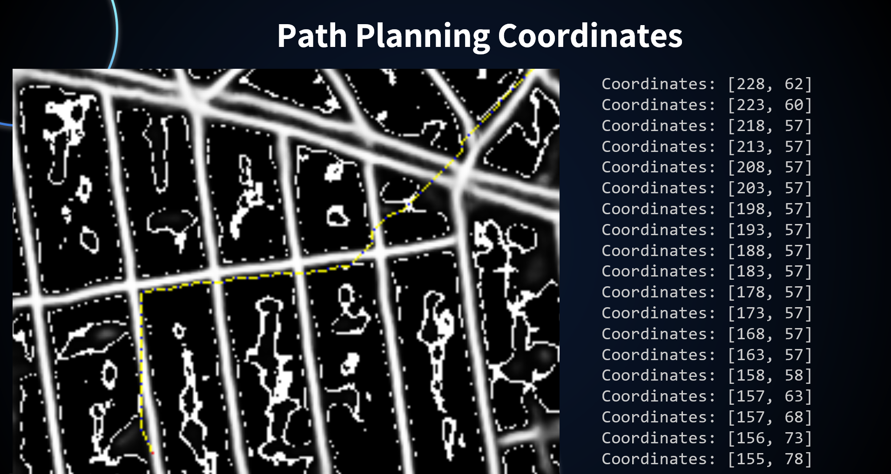
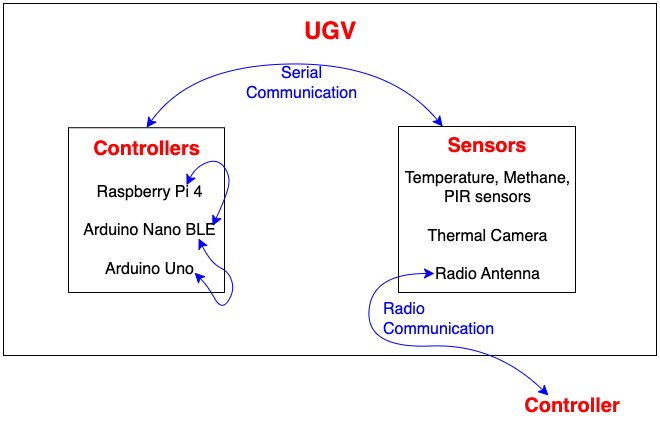
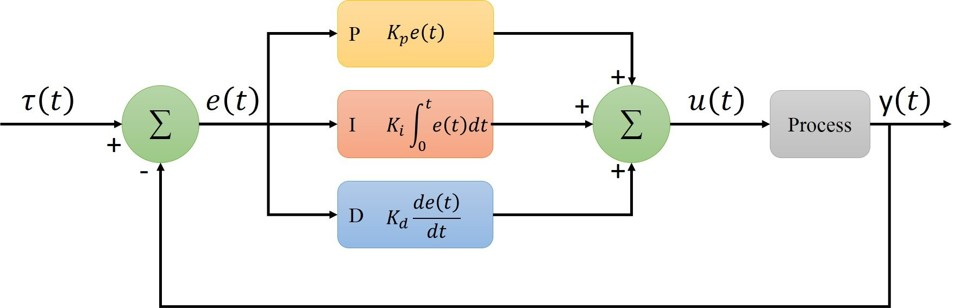
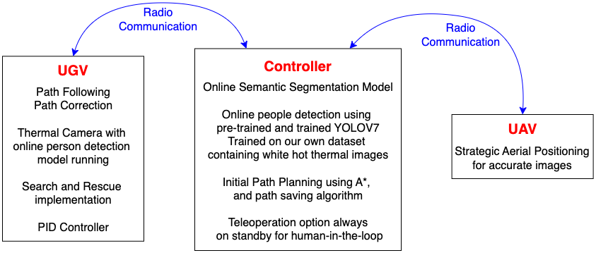
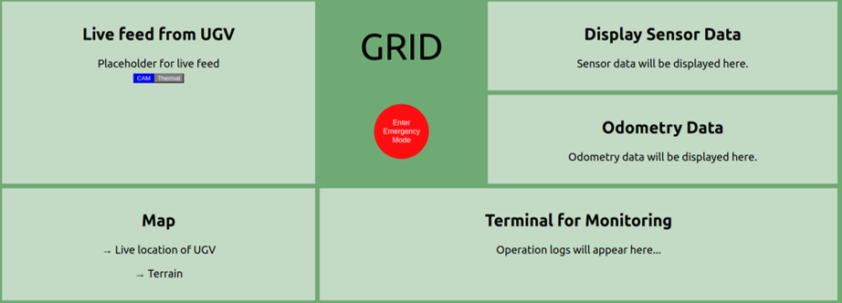

# GRID Project

🌍 **Ground and Aerial Integrated Deployment (GRID)** is an innovative search and rescue solution designed to overcome the limitations of traditional rescue systems. By integrating an Unmanned Ground Vehicle (UGV) and an Unmanned Aerial Vehicle (UAV), GRID provides efficient, autonomous support during disaster relief operations. Leveraging advanced computer vision, machine learning, and real-time data transmission, GRID ensures precise navigation and human detection in disaster-stricken areas.

---

## 🏆 D.A.R.E Competition Achievement

We are proud to announce that **GRID Project** secured **2nd place** at the **D.A.R.E Robotics Competition**! 🚀 This prestigious event is one of the largest robotics competitions in Lebanon, bringing together innovative minds to showcase groundbreaking technology in robotics. This achievement highlights our dedication and ingenuity in pushing the boundaries of search and rescue solutions.

---

## 🔍 Overview

Search and rescue operations often encounter challenges due to isolated functionality in existing systems and complex communication between UGVs and UAVs. GRID addresses these limitations through a synchronized, multi-agent platform that combines ground and aerial assets for a cohesive, autonomous disaster response.

---

## 🌟 Key Features

- **🤖 Dual-Agent System**: Integration of UGV and UAV, each with independent and teleoperated capabilities, maximizing versatility in search and rescue missions.
- **📍 Autonomous Navigation & Obstacle Avoidance**: Uses segmented path planning with A* algorithm and real-time obstacle detection to ensure safe and efficient UGV navigation.
- **🔥 Thermal Imaging for Human Detection**: Equipped with a thermal camera, the UGV identifies human signatures in disaster zones and relays location data for immediate rescue.
- **📡 Reliable Communication**: Robust data transmission with NRF24L01 radio modules, ensuring uninterrupted teleoperation even in areas lacking wireless networks.

---

## 📦 Project Components

### 1. 🛰️ **UAV - Aerial Mapping and Initial Path Planning**
   - **Mapping**: Captures aerial images of the disaster zone and transmits them to a U-Net model for segmentation, identifying navigable areas.
   - **Path Planning**: Utilizes an A* algorithm to determine the optimal route, sending coordinate-based instructions to the UGV.
   - **Hardware Setup**: A CNC rig simulates UAV flight for mapping purposes, due to budget constraints.

   

### 2. 🚜 **UGV - Autonomous Ground Navigation**
   - **Path Following**: Receives GPS-based coordinates from the UAV and navigates using PID control.
   - **Obstacle Detection & Path Correction**: Replans route autonomously upon detecting obstacles, ensuring safe and continuous operation.
   - **Thermal Camera & Human Detection**: Equipped with a YOLOv7-trained thermal camera, detecting human heat signatures for prompt rescue action.
   

     
   

### 3. 🧠 **U-Net - Semantic Segmentation**
   - **Purpose**: Segments UAV-captured images, identifying accessible paths and regions for UGV navigation.
   - **Architecture**: A robust network with skip connections, adaptable to diverse terrains and lighting conditions.

### 4. 🔍 **YOLOv7 - Real-time Human Detection**
   - **Functionality**: Detects human presence in thermal images from the UGV.
   - **Training Data**: Trained on a dataset of 22,000 white-hot thermal images, achieving high precision and recall.

### 5. 🕹️ **Controller and Communication Pipeline**
   - **Controller**: Serves as the central command, allowing both manual and autonomous UGV operation.
   
   - **Communication**: Uses NRF24L01 modules, providing reliable data transmission over distances up to 10 km.

   

---

## ⚙️ Implementation Details

- **📹 ESP32 CAM for Live Streaming**: Provides real-time UAV video feed for enhanced situational awareness.
- **🛠 CNC Rig for UAV Simulation**: Captures aerial views to simulate UAV mapping, although torque limitations restrict realism.
- **🎛️ Raspberry Pi Command Center**: Manages UGV operations and processes sensor data.
- **🖥️ Frontend Control Interface**: Displays odometry, sensor data, and telemetry with teleoperation controls for both routine and emergency modes.

   

---

## 📐 Technical Specifications

### Hardware
- **ESP32 CAM**: UAV imaging
- **Raspberry Pi 4 (8GB)**: UGV processing and control
- **Arduino Nano BLE & Arduino Uno**: Motor control and sensor integration
- **MLX90640 Thermal Camera**: Human detection
- **Additional Sensors**: MQ5 Gas sensor, DS18B20 temperature sensor, ultrasonic sensor, NEO-7M GPS module

### Software
- **ROS**: Sensor data management and UGV navigation.
- **CHAMP Framework**: Advanced locomotion capabilities.
- **Languages**: Python & C++ for algorithms and processing.
- **Libraries**: TensorFlow and OpenCV for computer vision and machine learning.

---

## 🧪 Testing & Evaluation

### Simulation
- **U-Net Testing**: Trained on a dataset of 420 aerial images for road segmentation, achieving reliable segmentation after minimal training (5 epochs).
- **YOLOv7 Training**: Trained on over 22,000 thermal images, resulting in high F1 scores, precision, and recall.

### Results
- **Thermal Imaging**: YOLOv7 accurately identified human signatures, providing precise coordinates for rescue.
- **Path Navigation**: Segmented path planning enabled efficient UGV navigation, though thermal camera resolution and budget constraints limited certain features.

---

## 🚀 Limitations and Future Work

- **Hardware Constraints**: CNC rig torque limitations affected UAV simulation. Low-resolution thermal cameras reduced human detection detail.
- **Future Improvements**:
  - Implement high-resolution thermal cameras and encoder-based positioning for enhanced UGV navigation accuracy.
  - Strengthen radio communication and add advanced teleoperation for greater control.
  - Refine heat map and SOS methodologies to improve danger zone identification.

---

GRID represents a robust, multi-agent search and rescue platform that combines UAV and UGV capabilities for a comprehensive and efficient disaster response solution. This README outlines the project's technical details, components, and areas for future enhancement.
